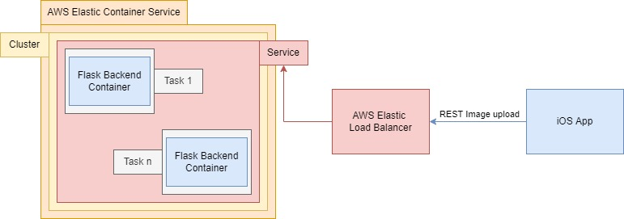
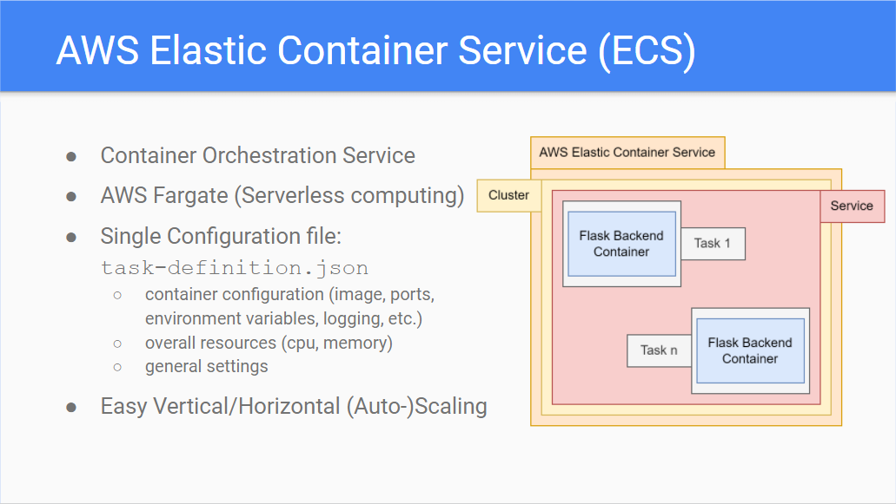
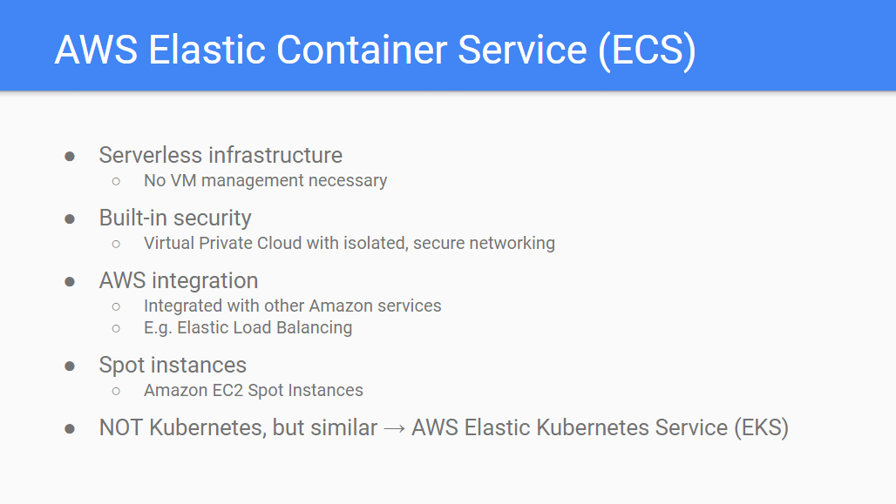
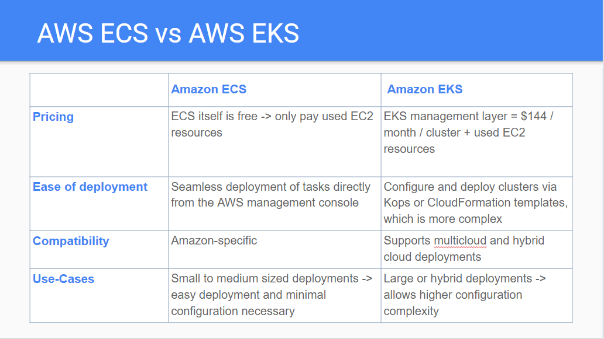
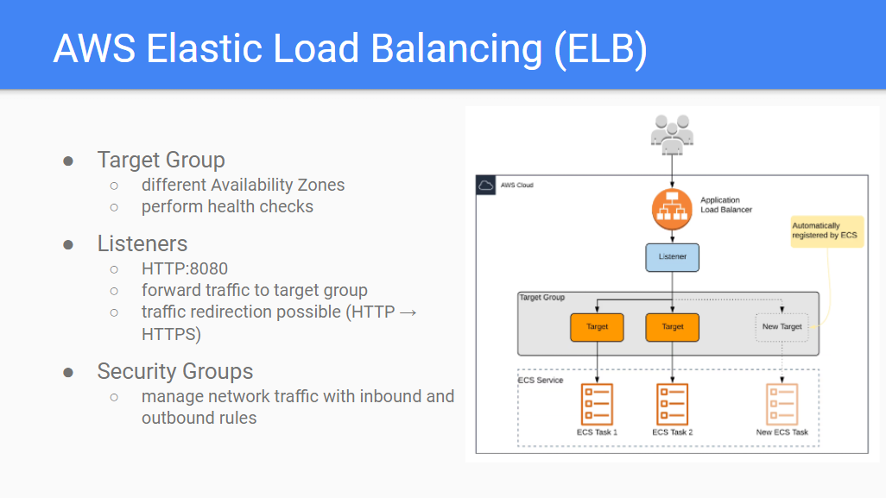
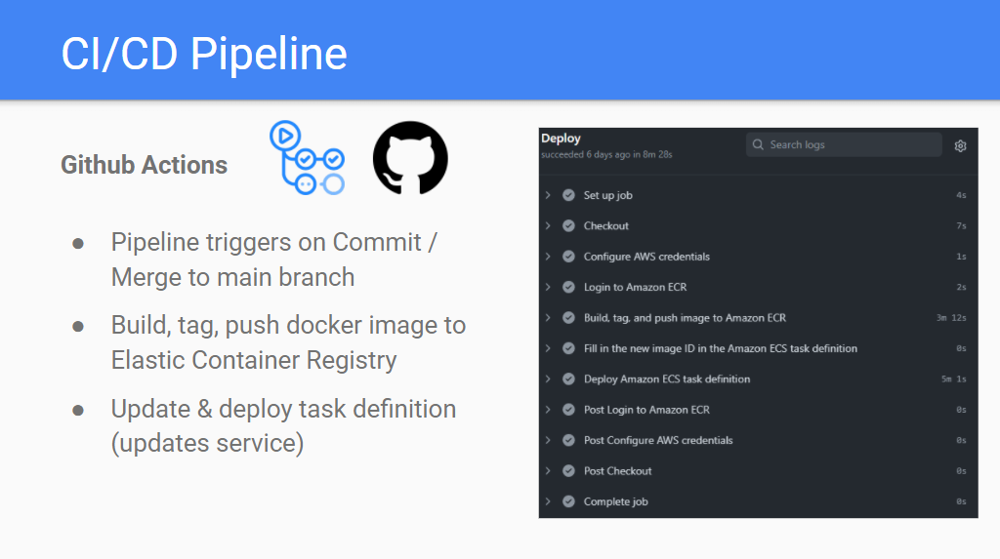

### WS 2021/22, CLC3, FH Hagenberg

# Passport Photo

## Group
* Alexander Karrer
* Peter Jedinger 
* Christoph Plank

## Project
#### Summary
This project shows a working prototype for a "Passport Photo" iOS app, which utilizes machine learning via a web service to support the process of making valid passport photos (person facing the camera). The machine learning model is wrapped in a Flask backend (python) and deployed to an AWS ECS managed cluster as a service. The iOS app communicates with the backend via a REST Api. The machine learning model was trained and tested as part of the "Computer Vision" course of this semester. The implementation of the web service, the integration of the model, the implementation of the app and the AWS deployment was done as part of the "Cloud Computing" course. A CI/CD pipeline for building the docker image and deploying it to AWS ECS was set up using GitHub actions.

#### Technologies
* AWS Elastic Container Registry
* AWS Elastic Container Service
* AWS Elastic Load Balancer
* Docker
* Flask Backend (Python)
* Machine Learning Model (trained with CNN)
* Native iOS App (Swift)
* Github Actions

#### Project Architecture

## Summary of research
(excerpts of our final project presentation, nicely formatted :) )
 

## Setup Tutorials
### Tutorial 1: Run backend project locally using Docker
1. Download the project folder
2. Change your working directory to the `flask_backend` project folder
3. Run docker build command `docker build . -t clc3_passphoto` (this may take some time)
4. Run docker run command `docker run -p 8080:8080 clc3_passphoto`
5. Goto [localhost:8080](http://localhost:8080/) in your web browser, to check if service is running.
6. If the server is running, you can now upload images for classification to the `POST http://localhost:8080/predict` endpoint. Basic Auth Authentication is required (user+password: `clc3`). The image has to be Base64 encoded and sent as a JSON body (`application/json`) in the following format: `{"Image": "<base-64-encoded-string>"}`. Hint: Use postman, aka 'in Postler' (austrian dialect recommended).
7. Have fun!
    
### Tutorial 2: Run app on Mac
Requirements: Mac OS, Apple Developer Id (non paid version sufficient)
1. Download the project folder
2. Open the `ios_app/CLC_Passport` folder as a project in XCode 
3. Go to Project Settings under `Signing & Capabilities` and set the team to your Apple Developer Id
4. Auto-generate signing certificate (should be button below the team setting)
5. Connect iPhone to Mac, or run the apple device simulator
6. Run the app.

### Tutorial 3: Deploy Backend to AWS
Requirements: AWS Account
1. Fork the repository
2. Create github user in AWS IAM with added policies: `AmazonECS_FullAccess` & `AmazonEC2ContainerRegistryFullAccess`
3. Register the `AWS_ACCESS_KEY_ID` and the `AWS_SECRET_ACCESS_KEY` in the 'Secrets' section of your Github Repository
4. Setup all necessary AWS resources in region `eu-central-1`: 
 - Create AWS ECR Image Repository
 - Create Security Group with Public Access (CIDR 0.0.0.0/0), later assign it to Service and Load Balancer
 - Create ECS Cluster (default settings)
 - Create ECS Service in Cluster (default settings, except: with Load Balancer listening on HTTP:8080, forwarding traffic to the target-group associated with your service)
6. Change all environemnt variables of the github workflow script (under `.github/workflows/aws.yml)` to the names of your created resources.
7. Commit changes to main branch, so the workflow is executed. Wait for the workflow to execute successfully.
8. Go to your AWS load balancer and copy paste the DNS name into your browser to check if the service is running and accessible. 
9. If the service is running you can now upload images for classification (as described in Tutorial 1, step 6).
10. Have fun.

#### Scaling
* Vertical Scaling can be done by increasing the memory / cpu settings in the task definition file (`.aws/clc3-passphoto-task-revision1.json`).
* Horizontal Scaling can be done by increasing the `Desired Tasks` setting in the ECS service.
* Automatic Horizontal Scaling can be done by configuring the `Minimum Tasks` and `Maximum Tasks` option in the ECS service under the tab `Autoscaling`
Note: After any changes to the scaling settings the ECS service has to be 'updated' via the AWS Interface or redeployed using the Github workflow.

## Summary of lessons learned
* Cloud Computing
  - Running software in ‘the cloud’ requires knowledge in lots of different computer science domains: Infrastructure, Networking, Security, DevOps, Development, …
  - Cloud Abstraction is really useful (e.g. not worrying about hardware)
  - Cloud is expensive $$$
  - All cloud providers ‘basically’ provide the same services
* General
  - Github Actions Templates are excellent
